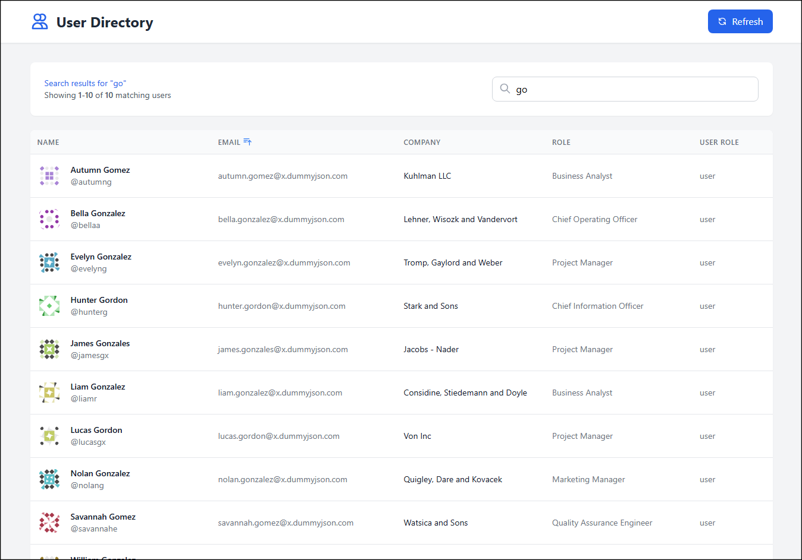
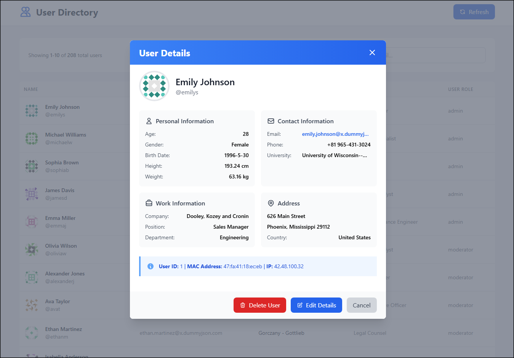

# User Directory Application

**[🔗 View Live Demo](https://lindenholt-whittaker.github.io/UserTable/)**

A modular vanilla JavaScript application with Tailwind CSS that displays user data from DummyJSON API with pagination, search, and sorting capabilities.





## Usage

1. **Browse Users**: Navigate through pages using pagination controls
2. **Search**: Type in the search box to find users by name, email, username, or company
3. **Sort**: Click column headers to sort by that field (server-side)
4. **View Details**: Click any user row to see full details in a modal
5. **Mock Actions**: Use Edit/Delete buttons in the modal (simulated actions)

## Development

### Prerequisites
- Node (for loading with http-server)
- Modern browser with ES6 module support

### Running the Application

```bash
# Start development server
npm run dev

# Open browser to http://localhost:8080
```

## API Integration

The application uses [DummyJSON](https://dummyjson.com) API with the following endpoints:

- `GET /users?limit={n}&skip={n}&sortBy={field}&order={asc|desc}` - Paginated users with sorting
- `GET /users/search?q={query}&limit={n}&skip={n}` - Search users with pagination
- `DELETE /users/{id}` - Mock delete user

## Browser Support

Requires modern browsers with support for:
- ES6 Modules
- Fetch API
- CSS Grid/Flexbox
- Arrow functions and template literals